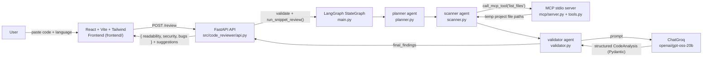

# AI Code Reviewer

> 🚀 **Live Demo:** [https://code-review-chi-seven.vercel.app/](https://code-review-chi-seven.vercel.app/)

**AI-powered code review that scores your code for `readability`, `security`, and `bug risk` — and turns the results into concrete, actionable suggestions.**

Paste a snippet, pick a language, and get a structured LLM review in seconds. Behind the scenes, a multi-agent **LangGraph** pipeline plans the review, discovers "project" files through a custom **Model Context Protocol (MCP)** server, and produces **Pydantic-validated structured output** from a Groq-hosted LLM.

<div align="center">

[](https://code-review-chi-seven.vercel.app/)
[](https://www.python.org/)
[](https://fastapi.tiangolo.com/)
[](https://langchain-ai.github.io/langgraph/)
[](https://groq.com/)
[](https://modelcontextprotocol.io/)
[](https://react.dev/)
[](https://vite.dev/)
[](https://tailwindcss.com/)
[](https://docs.astral.sh/uv/)

</div>

---

## Overview

**AI Code Reviewer** is a full-stack web application that performs an automated, LLM-driven code review of any pasted snippet. It splits the analysis into three interpretable dimensions — **readability**, **security**, and **bug risk** — scores each from 0–100, and lists short, specific improvement suggestions.

Unlike a linter, which relies on fixed rules, this project uses an **AI agent workflow** to reason about the code the way a human reviewer would. The user selects from **20 supported languages** and receives the report back as a clean, visual scorecard.

### What's behind the analysis

- A **LangGraph state graph** orchestrates three agents in sequence: `planner → scanner → validator`.
- The **planner** decides which review types to run for the given code.
- The **scanner** discovers files in the code's (temporary) project directory through an **MCP server**.
- The **validator** sends the snippet to a Groq-hosted LLM and returns a **structured, Pydantic-validated** analysis covering readability, security, and bugs.
- The **FastAPI** layer validates the request, clamps every score to 0–100, and returns a clean JSON contract to the frontend.

## Features

- **🔍 AI code review** — a LangGraph multi-agent pipeline (`planner → scanner → validator`) analyzes every snippet.
- **📊 Three review dimensions** — per-category scores (0–100) for **readability**, **security**, and **bug risk**, plus an overall score averaged from all three.
- **💡 Actionable suggestions** — each category comes with 2–4 short, specific improvement suggestions generated by the LLM (up to 12 shown per category).
- **🗣️ 20-language selector** — Python, JavaScript, TypeScript, Java, C, C++, C#, Go, Rust, Ruby, PHP, Swift, Kotlin, HTML, CSS, SQL, Bash, JSON, YAML, and plain text.
- **🧩 Model Context Protocol (MCP)** — a custom stdio MCP server exposes `list_files`, `read_file`, and `write_file`; the scanner agent discovers files through the MCP protocol.
- **🛡️ Structured LLM output** — `with_structured_output` + Pydantic models guarantee typed, validated analysis instead of free-form JSON.
- **⚡ FastAPI REST backend** — validated request/response models, clamped scores, CORS enabled, and auto-generated OpenAPI docs.
- **🎨 Polished React UI** — line-numbered code editor with scroll sync and Tab indentation, loading / empty / error states, and per-category score cards.
- **🧠 Defensive error handling** — the workflow never raises: the planner has a full-plan fallback, the validator retries once and degrades gracefully, and both API layers normalize unexpected values.
---

## Screenshots

### Code Review Interface

The two-panel workspace: paste code, choose a language, and hit **Review Code**.

<!-- Add screenshot here -->
`docs/screenshots/code-review.png`

### Review Results

Overall score plus per-category cards for readability, security, and bug risk, each with its own suggestion list.

<!-- Add screenshot here -->
`docs/screenshots/review-results.png`

### Loading & Error States

In-flight feedback while the LangGraph pipeline runs, and the retry experience when an analysis fails.

<!-- Add screenshot here -->
`docs/screenshots/loading-error-states.png`

---

## How It Works

```
┌──────────────────────────────────────────────────────────────┐
│  User pastes a code snippet, selects a language,             │
│  and clicks "Review Code"                                    │
└──────────────────────────┬───────────────────────────────────┘
                           ▼
┌──────────────────────────────────────────────────────────────┐
│  React + Vite frontend                                       │
│  POST /review  { "code": "...", "language": "python" }       │
└──────────────────────────┬───────────────────────────────────┘
                           ▼
┌──────────────────────────────────────────────────────────────┐
│  FastAPI (src/code_reviewer/api.py)                          │
│  validates input → run_snippet_review()                      │
└──────────────────────────┬───────────────────────────────────┘
                           ▼
┌──────────────────────────────────────────────────────────────┐
│  Snippet written to a temporary "project" dir                │
│  as snippet.<ext> (Python → .py, JS → .js, ...)              │
└──────────────────────────┬───────────────────────────────────┘
                           ▼
┌──────────────────────────────────────────────────────────────┐
│  LangGraph state graph (src/code_reviewer/main.py)           │
│  planner → scanner → validator, compiled with an             │
│  InMemorySaver checkpointer (unique thread per request)      │
└──────────────────────────┬───────────────────────────────────┘
                           ▼
┌──────────────────────────────────────────────────────────────┐
│  MCP stdio server (src/code_reviewer/mcp/)                   │
│  scanner calls list_files(project_path) to discover files    │
└──────────────────────────┬───────────────────────────────────┘
                           ▼
┌──────────────────────────────────────────────────────────────┐
│  Groq LLM (ChatGroq, openai/gpt-oss-20b, temperature 0)      │
│  validator asks for structured JSON backed by Pydantic models│
└──────────────────────────┬───────────────────────────────────┘
                           ▼
┌──────────────────────────────────────────────────────────────┐
│  FastAPI clamps scores to 0–100 and returns                  │
│  { readability, security, bugs } with suggestions            │
└──────────────────────────┬───────────────────────────────────┘
                           ▼
┌──────────────────────────────────────────────────────────────┐
│  Frontend renders the overall score, three category cards,   │
│  and their suggestion lists                                  │
└──────────────────────────────────────────────────────────────┘
```

### End-to-end steps

1. The frontend sends `code` + `language` to `POST /review` (proxied by Vite in dev, or configured via `VITE_API_BASE_URL`).
2. FastAPI strips and validates the payload — an empty snippet returns `400`.
3. `run_snippet_review()` writes the snippet into a temporary directory as `snippet.<ext>` so the existing **planner → scanner → validator** pipeline can process a raw snippet exactly like a project.
4. The **planner** (LLM, structured output) decides which review types make sense.
5. The **scanner** calls the **MCP `list_files`** tool to discover the files in the temp project.
6. The **validator** runs the LLM analysis, producing a Pydantic-validated `CodeAnalysis` (readability, security, bugs — each a 0–100 score plus 2–4 suggestions). It retries once and degrades gracefully on failure.
7. FastAPI maps the findings into the response contract (clamping scores, trimming to 12 suggestions per category); failures map to `502`.
8. The frontend's `useReview` state machine (`idle → loading → success/error`) drives the empty, loading, error, and results views.

---

## Architecture



Every request gets its own graph thread (`thread_id = snippet-<uuid>`) checkpointed in memory, so concurrent reviews never share state.
---

## Tech Stack

| Layer | Technology | Purpose |
|---|---|---|
| Frontend | React 18 · Vite 6 | Component-based UI, dev server & production builds |
| Styling | Tailwind CSS 4 · lucide-react | Utility-first styling, design tokens & icons |
| Frontend API client | `fetch` + env-driven base URL | `POST /review` calls (proxied in dev via Vite) |
| Backend API | FastAPI · Uvicorn | Async REST API (`GET /health`, `POST /review`) |
| Validation | Pydantic 2 | Typed request/response models, 0–100 score bounds |
| Agent workflow | LangGraph | Stateful `planner → scanner → validator` graph |
| LLM provider | Groq · ChatGroq (`openai/gpt-oss-20b`) | LLM reasoning at `temperature=0` |
| Structured output | LangChain `with_structured_output` | Pydantic-validated LLM responses |
| Agent tooling | MCP (Model Context Protocol) | Custom stdio server (`list_files`, `read_file`, `write_file`) + client |
| Environment | Python 3.13 · uv | Locked dependency management via `uv.lock` |

---

## Project Structure

```
.
├── README.md
├── pyproject.toml               # Backend package + dependencies (uv)
├── uv.lock                      # Locked Python dependency graph
├── requirements.txt             # Minimal dependency list (uv is primary)
├── .python-version              # Python 3.13
├── src/code_reviewer/
│   ├── api.py                   # FastAPI app: GET /health, POST /review
│   ├── main.py                  # LangGraph workflow + snippet runner
│   ├── agents/
│   │   ├── planner.py           # Decides which review types to run
│   │   ├── scanner.py           # Discovers files via the MCP tool
│   │   └── validator.py         # LLM analysis: readability / security / bugs
│   └── mcp/
│       ├── server.py            # MCP server exposing the file tools
│       ├── client.py            # stdio client used by the scanner
│       └── tools.py             # list_files / read_file / write_file
└── frontend/
    ├── index.html
    ├── package.json
    ├── vite.config.js           # Dev server + /review proxy to the backend
    ├── .env.example
    └── src/
        ├── App.jsx              # Two-panel editor / results layout
        ├── api/review.js        # POST /review client + score normalization
        ├── hooks/useReview.js   # Review state machine (useReducer)
        ├── data/languages.js    # 20 supported languages
        └── components/          # Editor, score cards, states, header
```
---

## Getting Started

### Prerequisites

- **Python 3.13** — managed with [uv](https://docs.astral.sh/uv/) (`.python-version` + `uv.lock`)
- **Node.js 20+** (tested with Node 24)
- A **Groq API key** (free at [console.groq.com](https://console.groq.com/))

### 1. Clone and sync the backend

```bash
git clone https://github.com/MustbeSarthak/AI-Code-Reviewer.git
cd AI-Code-Reviewer

# Install the Python environment and locked dependencies
uv sync
```

> The backend uses **uv**, not pip. `uv sync` installs everything from `pyproject.toml` + `uv.lock` into a `.venv`.

### 2. Configure the API key

Create a `.env` file in the repo root and add your Groq key (see [Environment Variables](#environment-variables)).

### 3. Install and run the frontend

```bash
cd frontend
npm install
npm run dev
```

That's it — the API runs at `http://127.0.0.1:8000` and the UI at `http://localhost:5173`.

---

## Environment Variables

### Backend — `.env` (repo root)

The LangChain Groq agents read the API key from the environment (`load_dotenv()` loads `.env` from the current directory). Only one variable is required:

```bash
# Required — used by the planner and validator agents
GROQ_API_KEY=your_groq_api_key_here
```

### Frontend — `frontend/.env` (see `frontend/.env.example`)

```bash
# Base URL of the review API. Leave empty to use the same origin
# (the Vite dev server proxies /review to VITE_PROXY_TARGET).
VITE_API_BASE_URL=

# Dev only: where to proxy /review requests during `npm run dev`.
VITE_PROXY_TARGET=http://localhost:8000
```

| Variable | Where | Required | Default |
|---|---|---|---|
| `GROQ_API_KEY` | root `.env` | ✅ Yes | — |
| `VITE_API_BASE_URL` | `frontend/.env` | No | same origin (empty) |
| `VITE_PROXY_TARGET` | `frontend/.env` | No (dev) | `http://localhost:8000` |

---

## Running Locally

### Backend (FastAPI)

```bash
cd AI-Code-Reviewer
uv sync                      # first time only
uv run uvicorn code_reviewer.api:app --reload --host 127.0.0.1 --port 8000
```

Or equivalently:

```bash
uv run python -m code_reviewer.api
```

Verify it's up:

- `GET http://127.0.0.1:8000/health` → `{"status": "ok"}`
- Interactive OpenAPI docs: http://127.0.0.1:8000/docs

> ⏳ Each review triggers two LLM calls (planner + validator), so the first response takes a few seconds.

### Frontend (React + Vite)

```bash
cd frontend
npm install      # first time only
npm run dev
```

- Dev UI: http://localhost:5173
- Production build: `npm run build` (outputs to `frontend/dist`)

During development, Vite proxies `POST /review` to the backend at `http://localhost:8000`, so no CORS setup is needed.

---

## API Overview

Interactive auto-generated docs: `http://127.0.0.1:8000/docs` (OpenAPI / Swagger UI).

### `GET /health`

Health check for the API server.

**Response `200`**

```json
{ "status": "ok" }
```

### `POST /review`

Runs the full LangGraph pipeline on a code snippet and returns the structured review.

**Request body**

```json
{
  "code": "def add(a, b):\n    return a + b",
  "language": "python"
}
```

| Field | Type | Description |
|---|---|---|
| `code` | `string` | Source code to review (must not be empty) |
| `language` | `string` | One of the 20 supported languages (default: `plaintext`) |

**Response `200`**

```json
{
  "readability": { "score": 82, "suggestions": ["Add type hints..."] },
  "security":    { "score": 90, "suggestions": [] },
  "bugs":        { "score": 74, "suggestions": ["Guard against..."] }
}
```

Scores are integers from 0–100 (higher is better); up to 12 suggestions per category.

**Errors**

| Status | Condition |
|---|---|
| `400` | `code` is empty after trimming — `{"detail": "code must not be empty."}` |
| `502` | The analysis pipeline failed or produced no findings — friendly `detail` message |
| `422` | Pydantic validation failure (e.g. missing `code`, score out of 0–100) |
---

## Deployment

### Frontend — Vercel ✅

The frontend is live on **Vercel**:

🔗 **https://code-review-chi-seven.vercel.app/**

The production build is generated with `npm run build` (Vite → `frontend/dist`). The repository contains no `vercel.json` — deployment is configured in the Vercel project dashboard.

### Backend

This repository does **not** contain a backend deployment configuration (no Dockerfile, platform config, or hosted API URL). The backend is designed to run with `uv` + Uvicorn on Python 3.13 and can be deployed to any host that supports Python — just set `GROQ_API_KEY` in the environment and run:

```bash
uv run uvicorn code_reviewer.api:app --host 0.0.0.0 --port 8000
```

> ⚠️ No real API keys or secrets are committed to this repository.

---

## Engineering Highlights

- **LangGraph multi-agent pipeline** — the review is a compiled `StateGraph` (`planner → scanner → validator`) sharing a typed `TypedDict` state, compiled with an `InMemorySaver` checkpointer and a unique `thread_id` per request for clean state isolation.
- **Snippet → "temporary repository" adapter** — a raw pasted snippet is written to a temp directory as `snippet.<ext>` (per-language extension map), so the same project-scanning pipeline handles both whole projects and single snippets without special-casing.
- **Custom MCP server + client** — file discovery is mediated by a real **Model Context Protocol** stdio server exposing `list_files`, `read_file`, and `write_file`; the scanner calls it through `ClientSession.call_tool` instead of hardcoding a directory walk.
- **Structured LLM output end-to-end** — `with_structured_output` + Pydantic models (`ReviewPlan`, `CodeAnalysis`) turn free-form LLM responses into validated, typed data.
- **Resilient by design** — the planner falls back to a full review plan on tool-call failures; the validator retries once and returns a graceful zero-score analysis instead of crashing the pipeline.
- **Defense-in-depth scoring** — scores are constrained by Pydantic (`Field(ge=0, le=100)`), clamped again in `api.py`, and normalized a third time on the frontend — malformed model output can never produce an out-of-range score.
- **Clean frontend/backend contract** — one REST endpoint (`POST /review`), a Vite dev proxy for same-origin development, and an env-driven `VITE_API_BASE_URL` for production separation.
- **Polished frontend engineering** — a reducer-based review state machine (`useReview`), scroll-synced line-number gutter, Tab-key indentation, ARIA progress bars, an `aria-live` results region, and defensive response normalization.

---

## Limitations

Honest notes on what the current implementation does **not** do:

- **LLM-driven, not static analysis** — there is no AST parsing, linter, or rule engine; the quality of the review depends entirely on the model's judgment.
- **Single-snippet review only** — no public GitHub repository scanning; the scanner only lists files in the local (temporary) project directory.
- **Requires `GROQ_API_KEY`** — without a key the pipeline cannot run; each review makes two sequential LLM calls, so latency is a few seconds.
- **No auth, rate limiting, or persistence** — graph state is in-memory and scoped to a single request; review history is not saved.
- **Long snippets are not truncated or chunked** — very large inputs may exceed the model's context window.
- **Report surfaces three categories** — the planner also reasons about `quality`/`complexity` flags, but the delivered report focuses on readability, security, and bugs.
- **No automated tests or CI** — the repository currently ships without a test suite or pipeline.
- **CLI entry point is a dev runner** — `code-reviewer` (in `pyproject.toml`) exercises the graph against a `./sample_project` directory, which is not committed to the repo; the web API is the real interface.

---

## Future Improvements

- [ ] **Full repository review** — point the pipeline at a cloned repo (or a GitHub URL) instead of a single snippet
- [ ] **Static-analysis layer** — AST parsing + linters (e.g. ESLint, Bandit) to complement the LLM
- [ ] **Async jobs** — queue + polling so large reviews don't block the request
- [ ] **Expand the report** — complexity/performance metrics, per-line annotations, markdown/PDF export
- [ ] **Persistence** — review history and shareable result links
- [ ] **Production hardening** — authentication, rate limiting, usage quotas
- [ ] **Backend deployment** — Dockerfile + hosted API configuration
- [ ] **Tests + CI** — unit tests for the graph agents, API, and frontend

---

## Author

**Sarthak Sharma**

- GitHub: [@MustbeSarthak](https://github.com/MustbeSarthak)

---

⭐ **If you found this project interesting, consider starring the repository.** Feedback, issues, and pull requests are always welcome.
